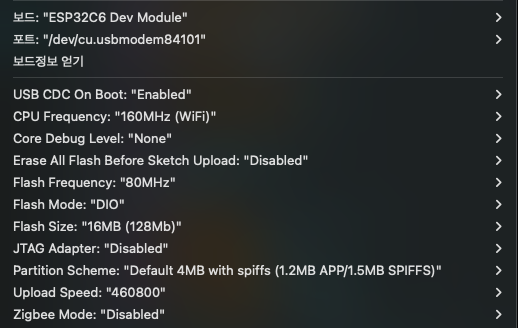

nanoESP32-C6
-----------
* [nanoESP32-C6 Introduce](#nanoESP32-C6-Introduce) 
* [Chip Diagram](#chip-diagram)
* [Demo](#Demo)
* [Product Link](#Product-Link)
* [Reference](#Reference)


# nanoESP32-C6 Introduce
nanoESP32-C6 is ESP32-C6 dev board made by MuseLab, base on ESP32-C6 Modules manufactured by Expressif, with on-board usb-to-serial, TYPE-C, RGB LED, and the dual-USB include usb-to-serial and the USB ESP32-C6 itself, more convenient for development and test.  


# Chip Diagram


# Demo
The preset factory test firmware source code is located in the demo directory. and the firmware is in firmware directory, expected that the RGB LED should start to flash after power-on. One of the two TYPE-C interfaces is CH343 USB for debugging and downloading, and the other is the USB of ESP32-C6, how to compile the source code show here
```
$git clone https://github.com/espressif/esp-idf.git
$cd esp-idf && ./install.sh && . ./export.sh
$cd examples/get-started/blink
$idf.py set-target esp32c6
$idf.py -p /dev/ttyACM0 flash monitor

```
# Product Link
[nanoESP32-C6 Board](https://www.aliexpress.us/item/3256805322371819.html?spm=a2g0s.12269583.0.0.41d93b9eV4OIj5&gatewayAdapt=glo2usa&_randl_shipto=US)

# Reference
### esp-idf
https://github.com/espressif/esp-idf
### esp32-c6 get-started
https://docs.espressif.com/projects/esp-idf/en/latest/esp32c6/get-started/
### esp32-c6
https://www.espressif.com/zh-hans/products/socs/esp32-c6


## ARDUINO IDE

